<div align="center">

```text
   ____   ______  ______  ___    ____   __ __  ____  _   __
  / __ \ / ____/ /_  __/ /   |  / __ \ / //_/ /  _/ / | / /
 / / / // /       / /   / /| | / /_/ // ,<    / /  /  |/ /
/ /_/ // /___    / /   / ___ |/ _, _// /| | _/ /  / /|  /
\____/ \____/   /_/   /_/  |_/_/ |_|/_/ |_|/___/ /_/ |_/
```



<p>
  <code>Cyber Security • Blue Team • SOC • DFIR</code>
</p>

<p>
  🌐 <strong><a href="https://octarkin.writ.workers.dev/">Visit My Security Blog → octarkin.writ.workers.dev</a></strong>
</p>

</div>

---

## `~/about`

```bash
octarkin@github:~$ cat about.txt

Name        : Octarkin - Nguyễn Mạnh Toàn
Field       : Cyber Security
Direction   : Blue Team / SOC
Focus       : SOC Analysis · Threat Detection · Incident Response
Interests   : SIEM/SOAR· Network Forensics · CTF
Status      : Learning · Building · Researching
```

---

## `~/current-focus`

```bash
octarkin@github:~$ cat current_focus.log

[+] Building and improving Blue Team / SOC projects
[+] Practicing threat detection and incident analysis
[+] Working with SIEM (Wazuh, Splunk) endpoint telemetry and network traffic
[+] Writing technical reports, research notes and CTF writeups
```

---

## `~/toolbox`

```text
[ SIEM / Detection ]   Wazuh · Sysmon · EDR

[ DFIR / Forensics ]   Wireshark · FTK Image · Volatility · Autopsy 

[ Systems ]            Linux · Windows

[ Languages ]          Python · Bash · PowerShell · Java · SQL

[ Infrastructure ]     Docker · VMware · Git
```
---

## `~/writeups`

```bash
octarkin@github:~$ ls ~/writeups/

SOC/
DFIR/
Network-Forensics/
Incident-Response/
CTF/
Research/
```

📚 **Full writeups & technical notes:**  
[https://octarkin.writ.workers.dev/](https://octarkin.writ.workers.dev/)

---

## `~/activity`

<div align="center">

<code>octarkin@github:~$ ./contributions.sh</code>

<br><br>



</div>

---

## `~/contact`

```bash
octarkin@github:~$ finger octarkin
```

**GitHub:** [github.com/NmTshark](https://github.com/NmTshark)  
**Blog:** [octarkin.writ.workers.dev](https://octarkin.writ.workers.dev/)  
**LinkedIn:** [linkedin.com/in/nmtshark](https://www.linkedin.com/in/nmtshark/)  
**TryHackMe:** [tryhackme.com/p/Tonishark](https://tryhackme.com/p/Tonishark)  
**Email:** [nguyenmanhtoan456@gmail.com](mailto:nguyenmanhtoan456@gmail.com)

---

<div align="center">

<sub><code>root@blue-team:~# detect → investigate → respond → improve</code></sub>

</div>